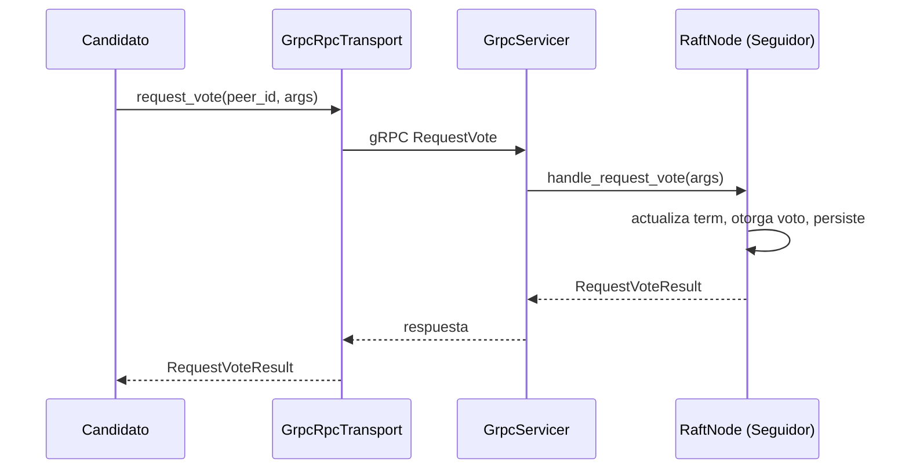
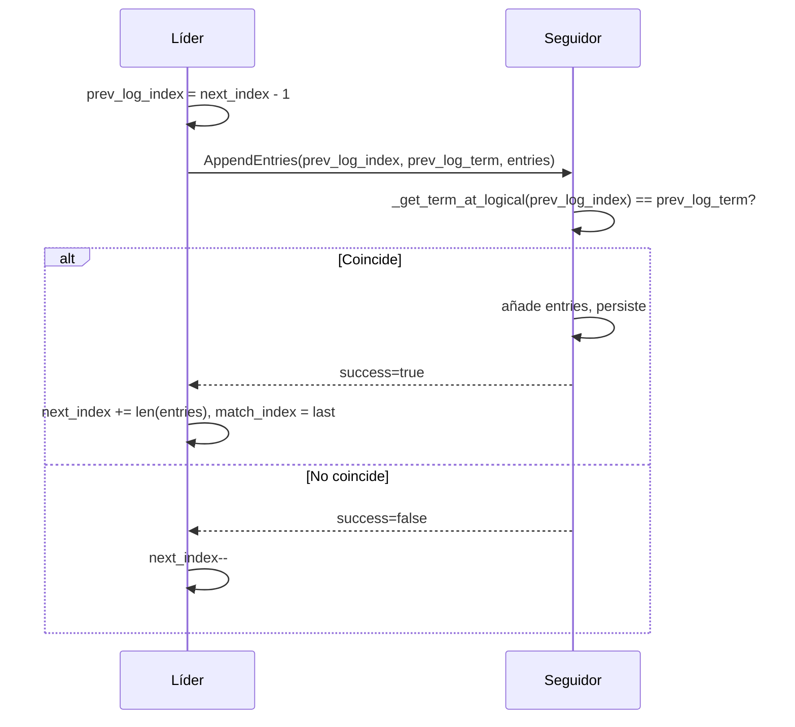
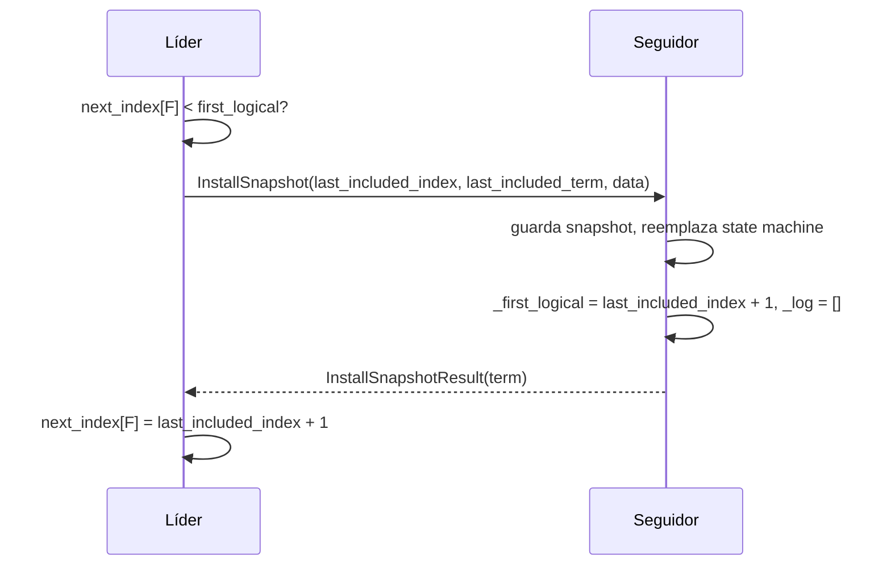

*[Read in English]({{ page.translation }})*

Construí [RaftyStore](https://github.com/abrange/raftystore) — un almacén clave-valor distribuido en Python usando el [algoritmo de consenso Raft](https://raft.github.io/raft.pdf) (Ongaro & Ousterhout, 2014). Incluye elección de líder, replicación de log y compactación mediante snapshots. En el camino me topé con dos bugs complicados que solo aparecían cuando entraban en juego snapshots y peers caídos. Este post describe los flujos y luego los bugs y sus correcciones.

---

## ¿Qué es Raft?

Raft es un algoritmo de consenso para máquinas de estado replicadas. Un clúster de nodos mantiene un log replicado; cuando una entrada se compromete, se aplica en el mismo orden a la máquina de estado de cada nodo. Los clientes hablan con cualquier nodo; las escrituras pasan por el líder y se replican a los seguidores.

**Roles:**
- **Leader (Líder)** — Procesa todas las peticiones de clientes, replica el log a los seguidores
- **Follower (Seguidor)** — Recibe y replica el log del líder, vota en elecciones
- **Candidate (Candidato)** — Compite por ser líder cuando no ha oído del líder

**RPCs:**
- **RequestVote** — Usado por candidatos durante elecciones
- **AppendEntries** — Heartbeats (vacíos) y replicación de log
- **InstallSnapshot** — Usado cuando el log del seguidor está retrasado y el líder lo ha truncado (snapshot)

**Compactación de log:** Para limitar el tamaño del log, el líder periódicamente hace snapshot de las entradas aplicadas en un único estado, trunca el log y puede enviar ese snapshot a seguidores retrasados vía InstallSnapshot.

---

## Dónde se usa Raft

Raft está ampliamente adoptado en sistemas de producción:

- **[etcd](https://etcd.io/)** — Almacén clave-valor distribuido que sirve de columna vertebral de [Kubernetes](https://kubernetes.io/) para coordinación y configuración del clúster.
- **[Consul](https://www.consul.io/)** — Service mesh y descubrimiento de servicios de HashiCorp; usa Raft para elección de líder y replicación de estado.
- **[CockroachDB](https://www.cockroachlabs.com/)** — Base de datos SQL distribuida que ejecuta muchos grupos Raft (uno por rango de datos) a través de su capa MultiRaft.
- **[TiKV](https://tikv.org/)** — Almacén clave-valor transaccional distribuido, parte del ecosistema TiDB.

---

## Flujos de RaftyStore

### Elección de líder

Cuando expira el timeout de elección de un seguidor, se convierte en candidato, incrementa su term, se vota a sí mismo y envía RequestVote a todos los peers. Con mayoría de votos, pasa a líder e inicia el bucle de heartbeats.



### Replicación de log (AppendEntries)

El líder envía AppendEntries a cada seguidor en un intervalo fijo. Cada RPC lleva `prev_log_index` y `prev_log_term` para una comprobación de consistencia: el seguidor debe tener esa entrada con ese term. Si no, rechaza; el líder decrementa `next_index` y reintenta. Si sí, el seguidor añade las entradas y el líder actualiza `next_index` y `match_index`.



### Snapshots e InstallSnapshot

Cuando el log supera un umbral, el líder toma un snapshot: serializa la máquina de estado y la guarda con `last_included_index` y `last_included_term`, luego trunca el log. Si el `next_index` de un seguidor es menor que el `first_logical` del líder (primer índice que sigue en el log), el líder envía InstallSnapshot en lugar de AppendEntries. El seguidor reemplaza su log y máquina de estado con el snapshot, pone `_first_logical = last_included_index + 1` y vacía su log en memoria.



El siguiente AppendEntries del líder tendrá `prev_log_index = last_included_index`. El seguidor debe aceptarlo verificando el term en ese índice — que ahora está en el snapshot, no en el log en memoria.

---

## Bug 1: El seguidor rechaza AppendEntries tras InstallSnapshot

**Síntoma:** El líder registra "Snapshot replicated to C" (o A) y en el siguiente ciclo vuelve a enviar InstallSnapshot. Parecía que `next_index` se revertía.

**Causa raíz:** Tras instalar un snapshot, el seguidor pone `_first_logical = last_included_index + 1` (p. ej. 9) y `_log = []`. El líder envía entonces AppendEntries con `prev_log_index = 8`. La comprobación de consistencia del seguidor llama a `_get_term_at_logical(8)`. La implementación anterior devolvía `None` cuando `logical_index < _first_logical`, porque la entrada ya no está en el log en memoria — está en el snapshot. El seguidor rechazaba AppendEntries, el líder decrementaba `next_index` y volvíamos a enviar InstallSnapshot en bucle.

**Corrección:** Cuando `logical_index < _first_logical`, consultar el snapshot. Si `logical_index == last_included_logical_index`, devolver `last_included_term` para que pase la comprobación de consistencia.

```python
# Antes
def _get_term_at_logical(self, logical_index: int) -> int | None:
    if logical_index < int(self._first_logical):
        return None  # Bug: ¡la entrada está en el snapshot!

# Después
def _get_term_at_logical(self, logical_index: int) -> int | None:
    if logical_index < int(self._first_logical):
        meta = self._snapshot_storage.load()
        if meta and meta.last_included_logical_index == logical_index:
            return meta.last_included_term
        return None
```

---

## Bug 2: Fallos de InstallSnapshot tratados como éxito

**Síntoma:** Con el peer A caído (solo B y C corriendo), el líder seguía registrando "Snapshot replicated to A" repetidamente. A nunca recibía realmente el snapshot.

**Causa raíz:** En el transporte gRPC, `install_snapshot` capturaba `grpc.RpcError` (timeout, conexión rechazada) y devolvía `InstallSnapshotResult(term=args.term)` en lugar de propagar la excepción. InstallSnapshotResult no tiene campo de éxito/fallo, así que el nodo interpretaba esto como éxito: actualizaba `next_index[A]` y registraba "replicated". En el siguiente ciclo, AppendEntries a A fallaba (A está caído), el líder decrementaba `next_index` y el ciclo se repetía.

**Corrección:** Dejar de capturar `grpc.RpcError` en `install_snapshot`. Dejar que se propague para que el llamador (que usa `send_to_peer` con `except Exception`) trate el RPC como fallido, no modifique `next_index` y no registre "replicated".

```python
# Antes
def install_snapshot(self, peer_id: str, args: InstallSnapshotArgs) -> InstallSnapshotResult:
    try:
        resp = stub.InstallSnapshot(req, timeout=self._timeout)
        return InstallSnapshotResult(term=resp.term)
    except grpc.RpcError:
        return InstallSnapshotResult(term=args.term)  # Bug: ¡indistinguible del éxito!

# Después
def install_snapshot(self, peer_id: str, args: InstallSnapshotArgs) -> InstallSnapshotResult:
    resp = stub.InstallSnapshot(req, timeout=self._timeout)
    return InstallSnapshotResult(term=resp.term)
```

Con este cambio, cuando A está caído el RPC lanza excepción, `next_index` se mantiene en 8 y el líder sigue reintentando InstallSnapshot sin registrar falsamente éxito — que es el comportamiento correcto de Raft para peers inalcanzables.

---

## Resumen de correcciones

| Bug | Ubicación | Problema | Corrección |
|-----|-----------|----------|------------|
| 1 | `_get_term_at_logical` | Devolvía `None` para `prev_log_index` en rango del snapshot | Cargar snapshot y devolver `last_included_term` cuando el índice coincide |
| 2 | `grpc_transport.install_snapshot` | Capturaba `RpcError` y devolvía resultado | Propagar excepción para que el fallo sea visible al nodo |

Ambos bugs solo aparecieron con snapshots y peers fallando o retrasados — el tipo de casos límite fáciles de pasar por alto en operación normal.

---

## Recomendaciones y lecciones aprendidas

**Índices lógicos vs. físicos.** Conviene tener clara esta distinción desde el principio. La mayor parte de la lógica de Raft habla de índices *lógicos* (1, 2, 3, …) que sobreviven al truncado del log y a los snapshots. Solo en unos pocos sitios — por ejemplo, al mapear a posiciones del array tras un snapshot — manejas índices *físicos* en el log en memoria. Confundirlos fue mi primer dolor de cabeza; una vez internalicé que casi siempre hablamos de índice lógico, el diseño cobró más sentido.

**gRPC en lugar de JSON.** Usar gRPC para los RPCs de Raft (en vez de JSON sobre HTTP) proporciona requests/responses tipados, serialización binaria eficiente y streaming integrado. Además, obliga a manejar explícitamente fallos de conexión y timeouts, lo que evita bugs sutiles como tratar errores de RPC como éxito.

**Decisiones de diseño en RaftyStore.** Algunas elecciones aquí se apartan de un Raft estándar:

- **Redirect HTTP al líder** — Cuando un cliente escribe a un seguidor, la API devuelve 307 con la URL del líder en lugar de hacer proxy de la petición. Los clientes pueden cachear el líder para menor latencia.
- **Un único archivo JSON por log y snapshot** — El log y el snapshot viven en un solo archivo JSON cada uno (p. ej. `log.json`, `snapshot.json`) en vez de archivos de segmento separados. Más simple para una implementación mínima, pero no ideal para logs muy grandes.

**Conceptos clave de este ejercicio.** El consenso trata intrínsecamente de sobrevivir fallos: crashes, particiones de red, peers lentos. Persiste el estado crítico antes de devolver; no asumas "éxito" salvo que tengas una señal clara; y ten cuidado al cruzar la frontera entre log en memoria y snapshot.

**Empieza con diseño multiproceso.** Ejecutar todos los nodos en un solo proceso puede facilitar el debug inicial, pero oculta la concurrencia y el comportamiento ante fallos reales. Empezar con un proceso por nodo (por ejemplo, varias terminales o un script simple) hace que los timeouts, los fallos de red y los cambios de líder se sientan reales desde el primer día y reduce sorpresas después.

---

RaftyStore está en GitHub: [github.com/abrange/raftystore](https://github.com/abrange/raftystore).
