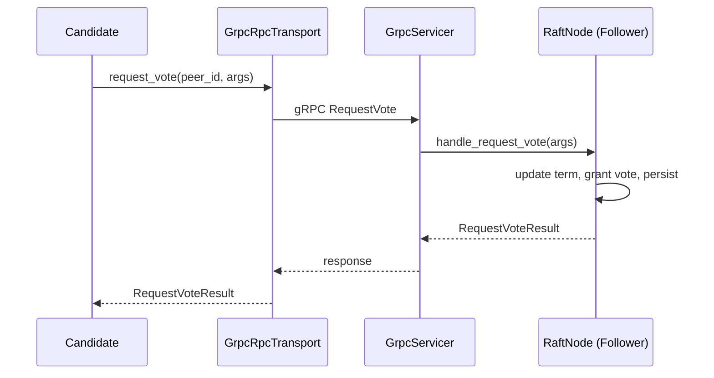
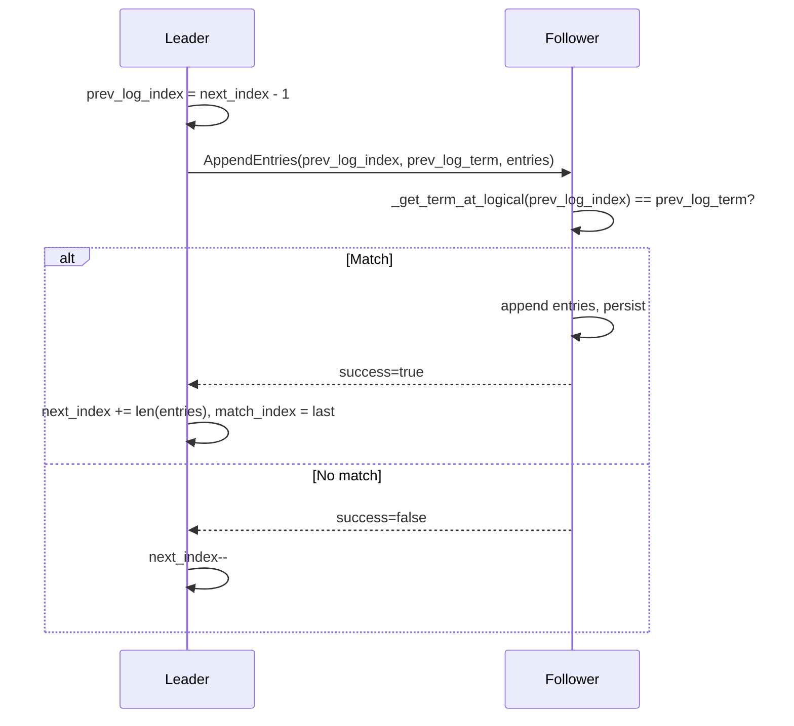
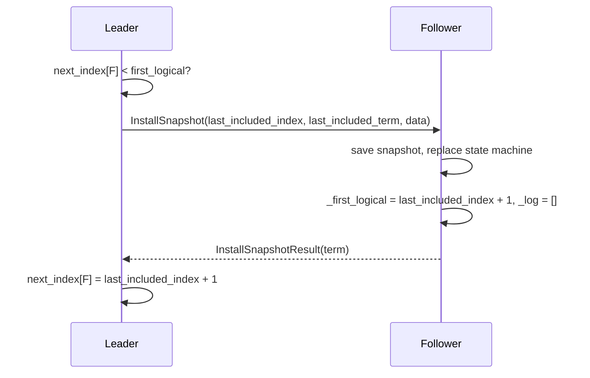

*[Leer en español]({{ page.translation }})*

I built [RaftyStore](https://github.com/abrange/raftystore) — a distributed key-value store in Python using the [Raft consensus algorithm](https://raft.github.io/raft.pdf). It includes leader election, log replication, and log compaction via snapshots. Along the way I ran into two tricky bugs that only appeared when snapshots and failing peers were involved. This post describes the flows, then the bugs and fixes.

---

## What is Raft?

Raft is a consensus algorithm for replicated state machines. A cluster of nodes maintains a replicated log; once a log entry is committed, it is applied to each node’s state machine in the same order. Clients talk to any node; writes go through the leader and are replicated to followers.

**Roles:**
- **Leader** — Handles all client requests, replicates log to followers
- **Follower** — Receives and replicates log from the leader, votes in elections
- **Candidate** — Runs for leadership when it hasn’t heard from the leader

**RPCs:**
- **RequestVote** — Used by candidates during elections
- **AppendEntries** — Heartbeats (empty) and log replication
- **InstallSnapshot** — Used when a follower’s log is behind and the leader has truncated it (snapshot)

**Log compaction:** To bound log size, the leader periodically snapshots applied entries into a single state, truncates the log, and can send that snapshot to lagging followers via InstallSnapshot.

---

## RaftyStore Flows

### Leader Election

When a follower’s election timeout fires, it becomes a candidate, increments its term, votes for itself, and sends RequestVote to all peers. With a majority of votes, it becomes leader and starts the heartbeat loop.



### Log Replication (AppendEntries)

The leader sends AppendEntries to each follower on a fixed interval. Each RPC carries `prev_log_index` and `prev_log_term` for a consistency check: the follower must have that entry with that term. If not, it rejects; the leader decrements `next_index` and retries. If yes, the follower appends new entries and the leader updates `next_index` and `match_index`.



### Snapshots and InstallSnapshot

When the log exceeds a threshold, the leader takes a snapshot: it serializes the state machine and saves it with `last_included_index` and `last_included_term`, then truncates the log. If a follower’s `next_index` is below the leader’s `first_logical` (first index still in the log), the leader sends InstallSnapshot instead of AppendEntries. The follower replaces its log and state machine with the snapshot, sets `_first_logical = last_included_index + 1`, and clears its in-memory log.



The next AppendEntries from the leader will have `prev_log_index = last_included_index`. The follower must accept it by verifying the term at that index — which is now in the snapshot, not the in-memory log.

---

## Bug 1: Follower Rejects AppendEntries After InstallSnapshot

**Symptom:** Leader logs “Snapshot replicated to C” (or A), then on the next cycle sends InstallSnapshot again. `next_index` appeared to revert.

**Root cause:** After installing a snapshot, the follower sets `_first_logical = last_included_index + 1` (e.g. 9) and `_log = []`. The leader then sends AppendEntries with `prev_log_index = 8`. The follower’s consistency check calls `_get_term_at_logical(8)`. The old implementation returned `None` when `logical_index < _first_logical`, because the entry is no longer in the in-memory log — it lives in the snapshot. The follower rejected AppendEntries, the leader decremented `next_index`, and we reverted to sending InstallSnapshot in a loop.

**Fix:** When `logical_index < _first_logical`, consult the snapshot. If `logical_index == last_included_logical_index`, return `last_included_term` so the consistency check passes.

```python
# Before
def _get_term_at_logical(self, logical_index: int) -> int | None:
    if logical_index < int(self._first_logical):
        return None  # Bug: entry is in snapshot!

# After
def _get_term_at_logical(self, logical_index: int) -> int | None:
    if logical_index < int(self._first_logical):
        meta = self._snapshot_storage.load()
        if meta and meta.last_included_logical_index == logical_index:
            return meta.last_included_term
        return None
```

---

## Bug 2: InstallSnapshot RPC Failures Treated as Success

**Symptom:** With peer A down (only B and C running), the leader still logged “Snapshot replicated to A” repeatedly. A was never actually receiving the snapshot.

**Root cause:** In the gRPC transport, `install_snapshot` caught `grpc.RpcError` (timeout, connection refused) and returned `InstallSnapshotResult(term=args.term)` instead of propagating the exception. InstallSnapshotResult has no success/failure field, so the node interpreted this as success: it updated `next_index[A]` and logged “replicated”. On the next cycle, AppendEntries to A failed (A is down), the leader decremented `next_index`, and the cycle repeated.

**Fix:** Stop catching `grpc.RpcError` in `install_snapshot`. Let it propagate so the caller (which uses `send_to_peer` with `except Exception`) treats the RPC as failed, leaves `next_index` unchanged, and does not log “replicated”.

```python
# Before
def install_snapshot(self, peer_id: str, args: InstallSnapshotArgs) -> InstallSnapshotResult:
    try:
        resp = stub.InstallSnapshot(req, timeout=self._timeout)
        return InstallSnapshotResult(term=resp.term)
    except grpc.RpcError:
        return InstallSnapshotResult(term=args.term)  # Bug: indistinguishable from success!

# After
def install_snapshot(self, peer_id: str, args: InstallSnapshotArgs) -> InstallSnapshotResult:
    resp = stub.InstallSnapshot(req, timeout=self._timeout)
    return InstallSnapshotResult(term=resp.term)
```

With this change, when A is down the RPC raises, `next_index` stays at 8, and the leader keeps retrying InstallSnapshot without falsely logging success — which is correct Raft behavior for unreachable peers.

---

## Summary of Fixes

| Bug | Location | Problem | Fix |
|-----|----------|---------|-----|
| 1 | `_get_term_at_logical` | Returned `None` for `prev_log_index` in snapshot range | Load snapshot and return `last_included_term` when index matches |
| 2 | `grpc_transport.install_snapshot` | Caught `RpcError` and returned a result | Propagate exception so failure is visible to the node |

Both bugs only surfaced with snapshots and failing or lagging peers — the kind of edge cases that are easy to miss during normal operation.

RaftyStore is on GitHub: [github.com/abrange/raftystore](https://github.com/abrange/raftystore).
